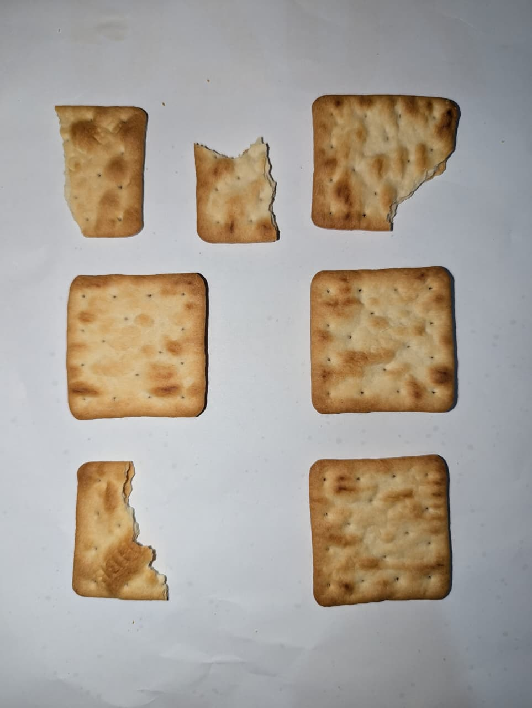
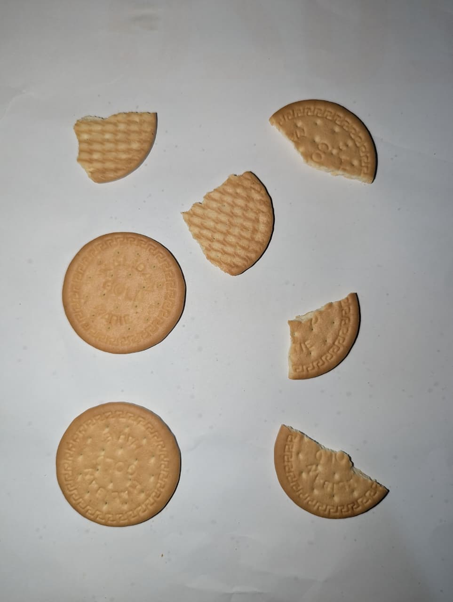
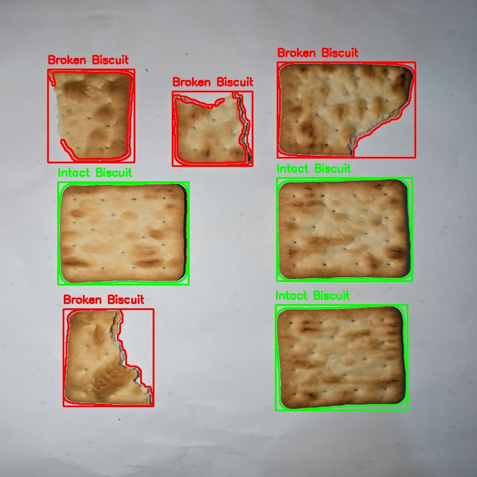
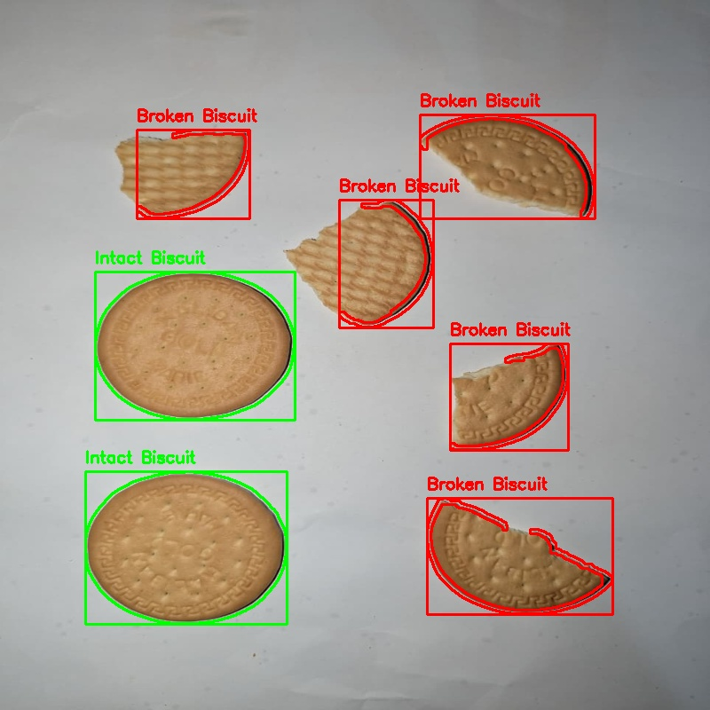

#  Broken Biscuit Detection using Classical Image Processing Techniques

##  Problem Description

In industrial food production, maintaining product quality is essential. One common issue is detecting whether biscuits are intact or broken during packaging.
This project presents an automated image processing solution that analyzes biscuit images and classifies them as:

•	Intact biscuits (complete shape) 

•	Broken biscuits (damaged or irregular shape) 

The system uses classical computer vision techniques to process images, extract features, and make decisions based on shape characteristics.


---

##  Tools and Libraries Used

* Python 3.x
* OpenCV (cv2)
* NumPy
* OS module 

---

##  Image Processing Methods Used

1. Preprocessing
2. Edge Detection
3. Morphological Operations
4. Contour Detection
5. Feature Extraction
6. Classification
   

---

##  Instructions to Run the Code

```bash
git clone https://github.com/sandarusilva43-code/Biscuit-Detection.git
cd biscuit-detection
pip install opencv-python numpy
python code.ipynb
```

---

##  Example Output Images

### Input




### Output



